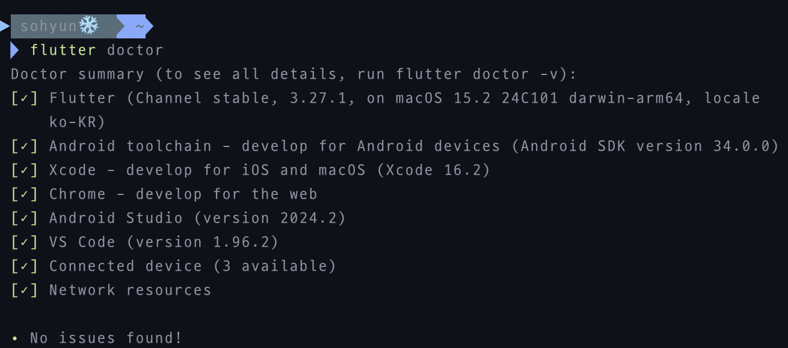
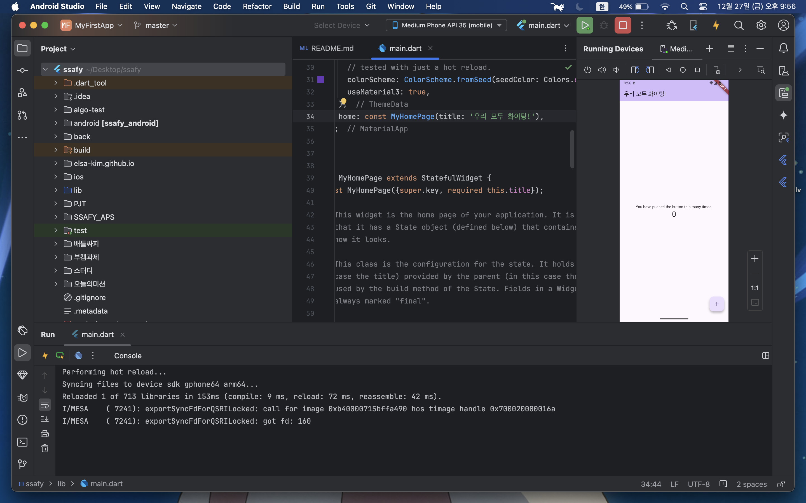

# Google Flutter 기반의 크로스플랫폼 앱개발 입문

## 과제

### 준비 과정

- 설치

  - `homebrew`를 사용해 설치

    - flutter 설치 : `brew install --cask flutter`
    - `Xcode` 설치 : 앱스토어
    - `cocoapods` 설치 : `brew install cocoapods`
    - `안드로이드 스튜디오` 설치 : `brew install --cask android-studio`
      - 실행 후 `SDK manager`에서 `Command-line Tools(latest)` 설치
      - 터미널에서 `flutter doctor --android-licenses` 실행 후 모두 `y` 눌러 동의

    

- 안드로이드 스튜디오 실행

  - Flutter Project 생성
    - 에러 상황 및 해결
      - `New Flutter Project` 버튼 없음
        - `Plugins`에서 `Flutter`, `Dart` 설치 후 재실행
  - Flutter Project 실행 - 에러 상황 및 해결 - `main.dart` 실행 시 `Failed to start Dart Development Service the Dart compiler exited unexpectedly.` 에러 발생 - 터미널에서 `flutter clean`, `flutter pub get` 후 재실행

### 기본 과제

1. Flutter의 Hot Reload
   

   - Hot Reload : 앱이 실행되고 있는 상태에서, 앱의 상태를 유지한 채로 변경사항을 적용시켜주는 기능. Hot reload를 통해 빠른 개발 사이클을 경험 가능
   - Hot Restart : 앱이 실행되고 있는 상태에서 변경사항을 적용시켜주는 기능. 단, 앱의 상태는 초기화 됨. Hot reload보다 시간이 조금 더 걸리지만, 앱을 재실행하는 것보다 훨씬 빠르게 변경사항 확인 가능

2. Flutter는 기본적으로 Debug 모드로 실행. Debug 모드는 Debugging 정보를 포함해 매우 느리게 앱이 실행됨. 이를 해결하기 위해 어떻게 처리할까?

   - Debug 모드
     - `flutter run` : default로 debug 모드 컴파일
     - emulator나 simulator에서 디버깅 할 수 있도록 함
     - 빠른 개발과 실행 주기 위해 최적화(hot reload 사용 가능)
   - Release 모드 사용
     - `flutter run --release`
     - 앱 배포할 때 사용(디버깅 비활성화 => emulator나 simulator에서 사용 불가)
   - Profile 모드 사용
     - `flutter run --profile`
     - 일부 디버깅 기능 유지(emulator나 simulator에서 사용 불가)

3. Flutter에서 외부패키지는 어떤 방식으로 사용하는가.
   - 필요한 외부 패키지 검색 : [pub.dev](https://pub.dev/)
   - 패키지 추가
     - `pubspec.yaml` 파일 : `dependencies`에 원하는 패키지와 버전을 추가, 저장 시 자동으로 `flutter pub get` 실행되어 의존성 다운로드
     - 터미널 : `flutter pub add 패키지명` 명령어 실행
   - 패키지 사용
     - 코드에서 import하여 사용
   - 의존성 업데이트 : 터미널에서 `flutter pub upgrade` 명령어 실행
4. Write your first app 파트를 끝까지 구현해보고 동작시키기
   - 버튼 추가 : 버튼 클릭 시 랜덤 단어 노출
     <image src="./assets/버튼추가.gif" height='100' style="display:block"/>
   - 위젯 꾸미기 : 랜덤 변경 단어 위젯으로 변경 및 스타일 적용
     <image src="./assets/위젯꾸미기.png" height='300' style="display:block"/>
   - 좋아요 기능 추가
     <image src="./assets/좋아요기능.gif" height='100' style="display:block"/>
   - 스테이트풀 위젯으로 변경 및 사이드(화면 변경) 추가
     <image src="./assets/화면전환.gif" height='300' style="display:block"/>
   - 새 페이지 추가 : 좋아요 한 단어 목록에 나타나도록
     <image src="./assets/페이지추가.gif" height='300' style="display:block"/>
   - 구현 중 느낀점 : 웹 페이지 구현과는 조금 다른 방식이라 낯설었지만, 재미있게 따라한 것 같다. `Refactor`를 많이 알아야 쉽게 할 수 있을 거라는 것을 느꼈다. 프로젝트를 하나 만들어보고 싶다는 생각을 했다.

### 심화 과제

1. 다수의 Flutter Samples 중 최소한 2개의 Platform을 선정하여 자유롭게 빌드해서 실행해보기
   - macOS
     <image src="./assets/macOS.gif" height='300' style="display:block"/>
   - ios(iphone SE)
     <image src="./assets/iphone.gif" height='300' style="display:block"/>
2. 본인이 개발하고 싶은 Cross-Platform 앱
   - 기존 Vue.js로 구현한 웹페이지인 Fitness BET 프로젝트를 Cross-Platform 앱으로 다시 구현해보고 싶다. 또는 추후 팀프로젝트를 모바일에 맞는 서비스쪽으로 방향을 맞추어 진행해보고 싶다.
