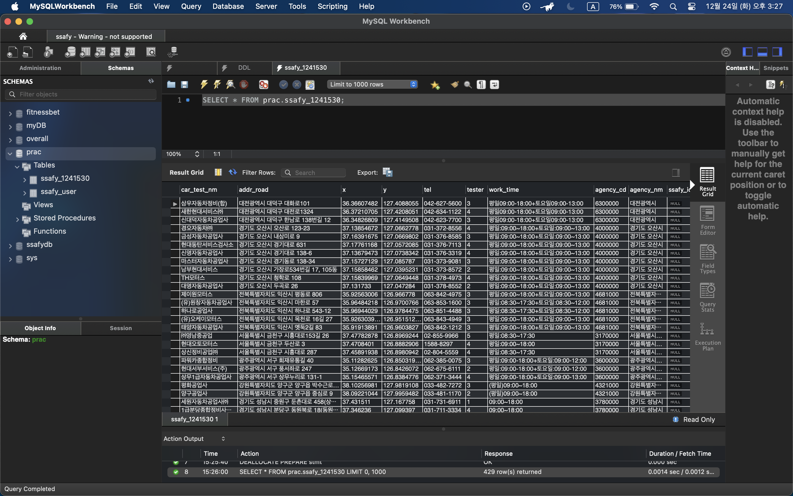
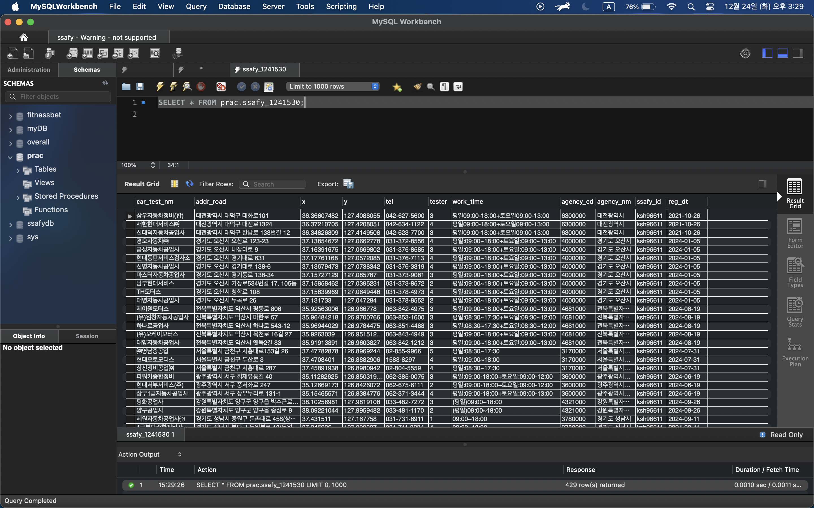
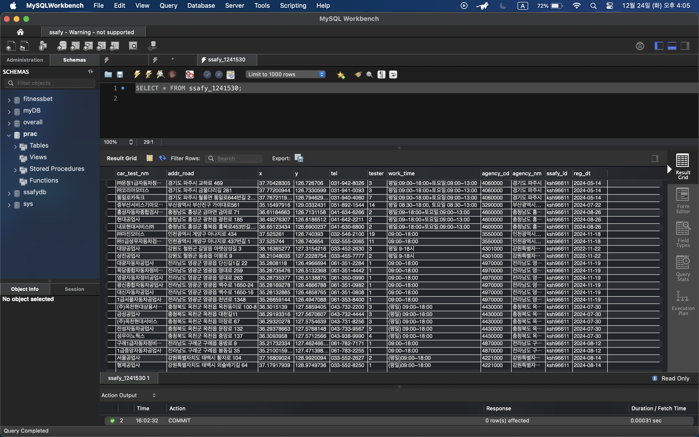

## RDBMS 데이터 전처리

### 과제 수행 과정

- csv 다운 후 필요없는 컬럼 제거
  [csv 파일 보기](./assets/전국자동차검사소표준데이터.csv)
- MySQL workbench에서 `Table Data Import Wizard` 실행 후 import

  - `unhandled exception: 'ascii' codec can't decode byte 0xec in position 75: ordinal not in range(128)` 에러 발생

    - 해결 시도
      1. 테이블 컬럼명 영문으로 변경
      2. csv 파일명 영문으로 변경
      3. workbench 종료 후 터미널 명령어로 workbench 재실행 -> 해결

    

- sql 쿼리 통해 ssafy_id 일괄입력

  ```sql
  UPDATE ssafy_1241530 SET ssafy_id = 'ksh96611';
  ```

  

- Sql 쿼리를 이용하여 자동차검사소명 필드의 특수문자 제거

  ```sql
  UPDATE ssafy_1241530 SET car_test_nm = REGEXP_REPLACE(car_test_nm, '[`~!#$%^&*|\\\'\";:\/?]','');
  ```

- Sql 쿼리를 이용하여 자동차검사소명 필드의 텍스트 공백제거
  ```sql
  UPDATE ssafy_1241530 SET car_test_nm = REGEXP_REPLACE(car_test_nm, ' ','');
  ```
  
- 위도, 경도 필드 값을 소수점 2자리까지만 남도록 가공
  ```sql
  UPDATE ssafy_1241530 SET x = CONVERT(CAST(x AS DECIMAL(10,2)), CHAR);
  UPDATE ssafy_1241530 SET y = CONVERT(CAST(y AS DECIMAL(10,2)), CHAR);
  ```
  
- 검사소인력수 값이 없는 경우 결측치 처리
  - data import 시 값 없는 데이터 table에 추가되지 않음
- Sql 쿼리 이용하여 교육생의 해당캠퍼스 지역에 속해있는 검사소만 추출하여 CSV파일로 저장
  - 오류 해결 과정
    - `Table Data Export Wizard`와 터미널 사용해 export 시도했을 때 `ERROR 1290 (HY000): The MySQL server is running with the --secure-file-priv option so it cannot execute this statement` 에러 노출
    - `--secure-file-priv` 확인하니 `NULL` 값 == MySQL이 허용하는 경로에서만 읽고 쓸 수 있는데, 경로 지정되어있지 않아 어떤 파일이든 읽고 쓸 수 없음
    - 설정 파일인 `my.cnf`도 존재하지 않아 다른 방법 탐색
  - 해결방법
    - workbench에서 `SELECT`문 실행 후 결과 표에서 export 버튼 클릭
    ```sql
    SELECT * FROM ssafy_1241530 WHERE agency_nm LIKE '%서울%';
    ```
    [export data 보기](./assets/export-data.csv)
