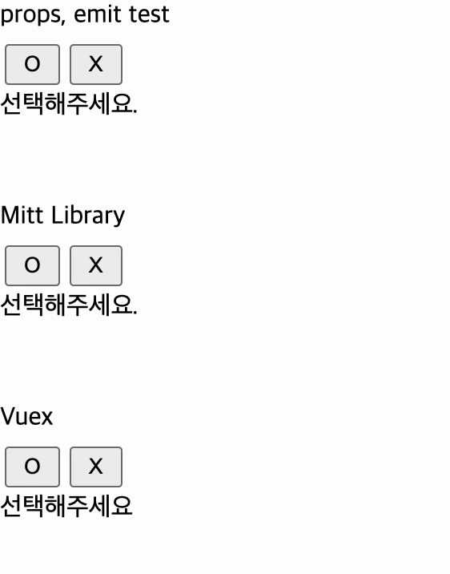

## Vue3의 데이터 전송 방법

### props, emit을 활용해 데이터를 전송

- 특징
  - Vue의 기본적인 데이터 흐름 방식
  - 부모 → 자식: `props`로 데이터 전달
  - 자식 → 부모: `emit`으로 이벤트 전달
- 장점
  - 부모와 자식 간 데이터 흐름이 명확, 작은 컴포넌트 구조에서 쉽게 구현 가능
  - 컴포넌트 간 의존성이 낮아 재사용성이 높음
  - 단방향 데이터 흐름(props)과 이벤트 기반 통신(emit)을 준수
- 단점
  - 컴포넌트 계층이 깊어질 경우, 중간 컴포넌트가 데이터를 전달만 하게 되는 `prop drilling` 문제 발생
  - 컴포넌트 간 데이터 공유가 많은 경우 복잡해짐

### Mitt Library 를 활용해 Component 간 데이터를 전송

- 특징
  - Mitt는 작은 이벤트 버스로, 컴포넌트 간 직접적인 이벤트 기반 통신을 가능하게 함
  - Vue의 공식 라이브러리가 아님
- 장점
  - 부모-자식 관계가 아니라도 데이터를 쉽게 공유 가능
  - Vuex 같은 상태 관리 라이브러리에 비해 설정이 간단
  - 특정 이벤트를 관리하고 사용할 수 있어 코드가 가독성 높음
- 단점
  - Vuex처럼 중앙에서 상태를 관리하지 않으므로 데이터 일관성이 떨어질 수 있음
  - 이벤트가 여러 곳에서 발생하면, 발생 위치와 처리 로직을 추적하기 어려울 수 있음
  - Mitt로 관리하는 이벤트나 상태는 Vue DevTools에서 추적되지 않음

### Vuex 를 통해 데이터를 전송

- 특징
  - Vue의 상태 관리 라이브러리
  - 상태를 중앙에서 관리하고 어디서든 접근 가능
- 장점
  - 모든 컴포넌트가 공유하는 상태를 한 곳에서 관리하며 데이터 흐름이 명확하고 일관성 있음
  - 상태와 Mutation/Action의 흐름을 시각적으로 확인 가능
  - 여러 컴포넌트 간 상태 공유와 복잡한 데이터 흐름 처리에 적합
  - 상태(Read)와 변경(Write)을 명확히 구분해 버그를 줄임
- 단점
  - 작은 프로젝트에서는 오히려 과도한 설정이 될 수 있음
  - Vuex의 구조(Mutation, Action, State, Getter)를 이해해야 함
  - 간단한 상태 변경도 Mutation과 Action을 정의해야 하므로 코드가 길어짐

### 실습 실행 결과

### 정리

- Mitt 라이브러리와 Vuex를 처음 사용해봤는데, Vuex는 조금 복잡한 느낌이 있었고, Mitt은 간단하게 사용하기 좋았던 것 같다.
- `emit`, `props` 사용 코드 : [Parent](./vue-project/src/components/Parent.vue), [Children](./vue-project/src/components/Children.vue)
- `Mitt` 사용 코드 : [Mitt 컴포넌트](./vue-project/src/components/Mitt.vue), [emitter](./vue-project/src/mitt.js)
- `Vuex` 사용 코드 : [store](./vue-project/src/store.js), [vuex 컴포넌트](./vue-project/src/components/Vuex.vue)
