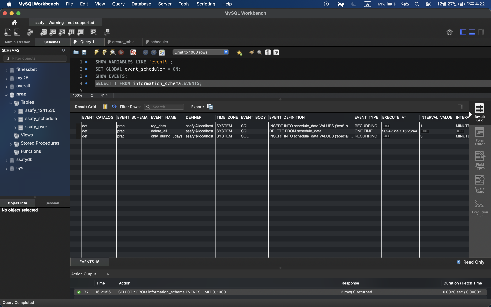
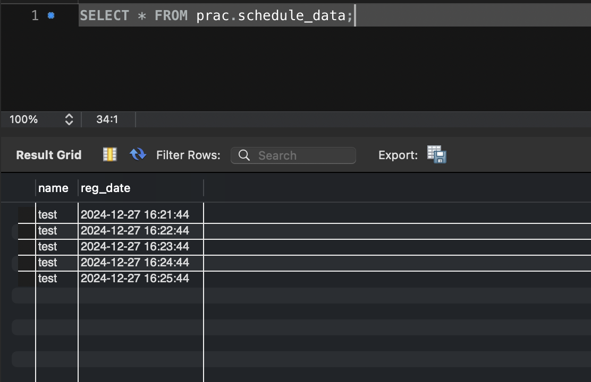
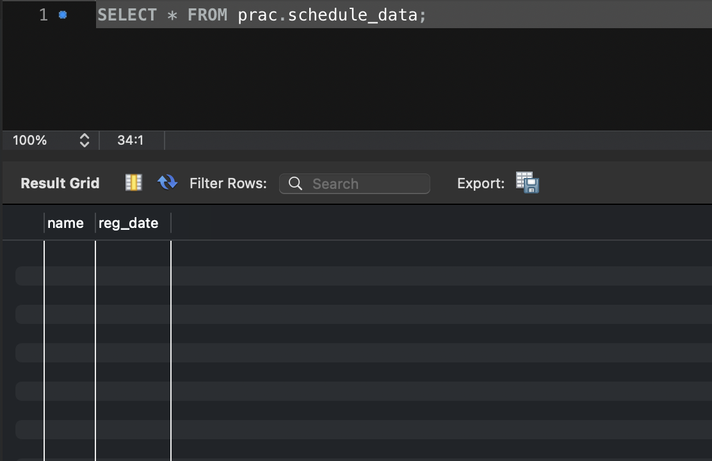
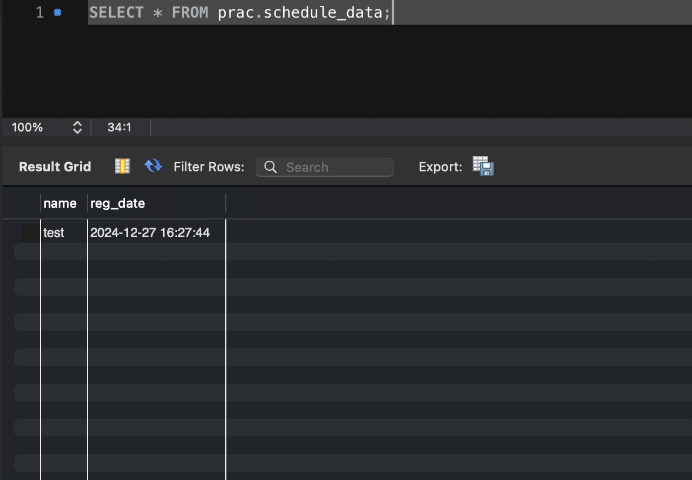

## Mysql Event Scheduler를 이용한 스케쥴러 개발

### Event Scheduler 생성 전 확인 사항

1. MYSQL 서버의 Event Scheduler 사용 여부 확인
   ```sql
   SHOW VARIABLES LIKE 'event%';
   ```
2. value가 `OFF`면 `ON`으로 변경
   ```sql
   SET GLOBAL event_scheduler = ON;
   ```
   
3. MYSQL 내에 저장된 Event Scheduler가 있는지 확인
   ```sql
   SHOW EVENTS;
   SELECT * FROM information_schema.EVENTS;
   ```
   

### Event Scheduler 구문

- 공식 문서 참고 : [공식문서 보기](https://dev.mysql.com/doc/refman/8.0/en/create-event.html)

```sql
CREATE
    [DEFINER = user]
    EVENT
    [IF NOT EXISTS]
    event_name
    ON SCHEDULE schedule
    [ON COMPLETION [NOT] PRESERVE]
    [ENABLE | DISABLE | DISABLE ON SLAVE]
    [COMMENT 'string']
    DO event_body;

schedule: {
    AT timestamp [+ INTERVAL interval] ...
  | EVERY interval
    [STARTS timestamp [+ INTERVAL interval] ...]
    [ENDS timestamp [+ INTERVAL interval] ...]
}

interval:
    quantity {YEAR | QUARTER | MONTH | DAY | HOUR | MINUTE |
              WEEK | SECOND | YEAR_MONTH | DAY_HOUR | DAY_MINUTE |
              DAY_SECOND | HOUR_MINUTE | HOUR_SECOND | MINUTE_SECOND}
```

- `event_name` : 이벤트명
- `event_body` : 실제 수행될 쿼리문
- `schedule` : 이벤트 수행, 반복할 시간 및 기간
  - `AT` : 수행할 시간
  - `EVERY` : 반복할 시간
  - `STARTS`, `ENDS` : 반복할 기간

### 실습

- TABLE 생성(간단하게 Insert 가능한 Table)
  ```sql
  CREATE TABLE schedule_data(
      `name` VARCHAR(100),
      `reg_date` DATETIME
  );
  ```
- 1분마다 데이터 등록되는 Event Scheduler 작성
  ```sql
  CREATE
    EVENT
    reg_date
    ON SCHEDULE EVERY 1 MINUTE
    COMMENT '1분마다 데이터 생성'
    DO INSERT INTO schedule_data VALUES ('ssafy', now());
  ```
- 현재 시각으로부터 5분 후 모든 데이터를 삭제하는 Event Scheduler 작성
  ```sql
  CREATE
  EVENT
  delete_all
  ON SCHEDULE AT ADDDATE(NOW(), INTERVAL 5 MINUTE)
  COMMENT '5분 후 데이터 삭제'
  DO DELETE FROM schedule_data;
  ```
- 특정 기간 동안만 반복 실행되는 Event Scheduler 작성
  ```sql
  CREATE
  EVENT
  only_during_5days
  ON SCHEDULE EVERY 3 MINUTE
  STARTS (current_date() + INTERVAL 1 DAY)
  ENDS (current_date() + INTERVAL 6 DAY)
  COMMENT '5일 동안만 작동되는 스케쥴러'
  DO INSERT INTO schedule_data VALUES ('special', now());
  ```
- Scheduler가 정상적으로 작동하는지 Data 변화 확인
  
  - 데이터 쌓이는 모습
    
  - 5분 지나 등록된 scheduler 작동
    
  - 그 후 다시 데이터 등록됨
    

### 심화 학습

#### DELIMITER 사용

- 문법의 끝을 나타내는 역할인 구문문자를 정의하는 기능
- CREATE구문에 여러 개의 Query문 사용을 위해서는 반드시 delimiter를 정의해 주어야함
  - Procedure, Event, Function 등 정의 시 내부에 세미콜론을 사용하기 때문에 Delimiter를 설정하지 않으면 문장을 구분하기 어려움
- 사용법
  ```sql
  -- '$$'를 구문문자로 사용
  DELIMITER $$
  ```
